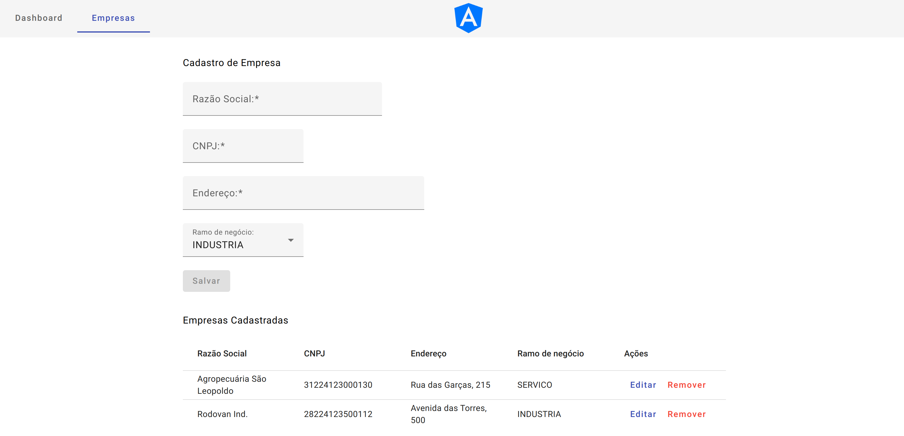
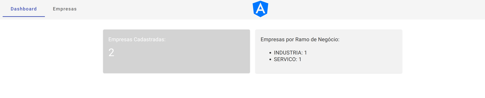

# Definição do projeto
Projeto simples para amostra. Consiste em um cadastro de empresas, demonstrando um CRUD básico e fluxo de telas entre cadastro e dashboard.

Backend em spring-boot 2.7.9, MVC, utiliza Java 1.8.
Frontend em angular 15.2.0.
Database utiliza MariaDb.

### Executando em ambiente local

Para executar essa aplicação em modo local, primeiro certifique-se que o container `traefik` está em execução.
A partir da pasta raiz do projeto, acesse a pasta docker-compose e execute o comando para iniciar o container:
> cd docker-compose
> docker-compose up -d traefik
>

O container mariadb é dependência do container do backend, então irá iniciar antes do build, automaticamente.
Senão, utilize o comando abaixo antes de executar o backend novamente:
> docker-compose up -d mariadb
>

Na raiz da pasta do backend, execute:
> mvn install
>
> mvn spring-boot:run 
> 

Para inicializar o frontend, utilize o comando:
> npm install && ng serve 
>

Cada repositório, backend e frontend, possui um README com maiores detalhes.

# Pra que serve esse projeto?
Implementar o seu projeto sem a necessidade de começar do zero. A base está pronta e funcional para implementar regras de negócio necessárias.

## Está 'containerizado'?
Parcialmente. Dei o pontapé inicial e alguns repos dentro do projeto, como o mariadb e frontend já funcionam "de boas".

## Posso usar esse projeto quando quiser, para provas, projetos particulares e ver se sirvo para ser desenvolvedor?
Sim, fique à vontade. É tudo nosso.
Se precisar de ajuda, pode chamar. Vou tentar no que puder... boa sorte!

### Telas do frontend

  

  

